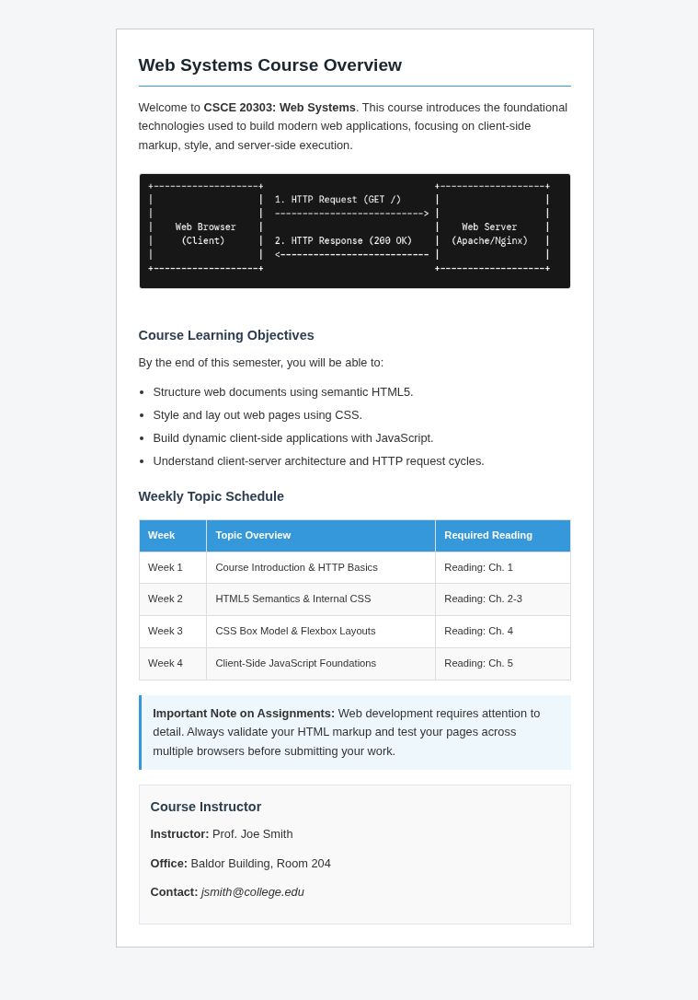

## CSCE 20303 Web Systems: - Week Two Assignment: Basic HTML and CSS

Overview
In this assignment, you will convert raw, unformatted text into a clean, semantically structured HTML5 web document. Once structured, you will apply basic CSS formatting using an internal stylesheet to format fonts, colors, spacing, and page layout.  **Your goal is to make your final document look like the following page image.**

### Learning Objectives

* Mark up plain text using appropriate semantic HTML elements.

* Implement an internal CSS stylesheet within the <head> of your document.

* Center a content container on the screen using standard box model properties (width: 650px; margin: 0 auto;).

* Apply basic visual design principles including line height, color contrast, background shading, and border accents.

## Technical Requirements & Constraints

* Single File Only: All HTML structure and CSS styles must be contained within a single file named **home.html**. Do not create or link external .css files.

* Internal Stylesheet Required: Place all CSS inside a style element inside the document head. Do not use inline style="..." attributes on individual HTML tags.

* No Responsive Design / Media Queries: Do not use media queries or dynamic screen units (vw, %). Use a fixed layout container (width: 650px).

## Provided Unformatted Raw Text

Copy and paste the raw text in the **content.txt** your HTML document body, then add the appropriate HTML structural tags around it: